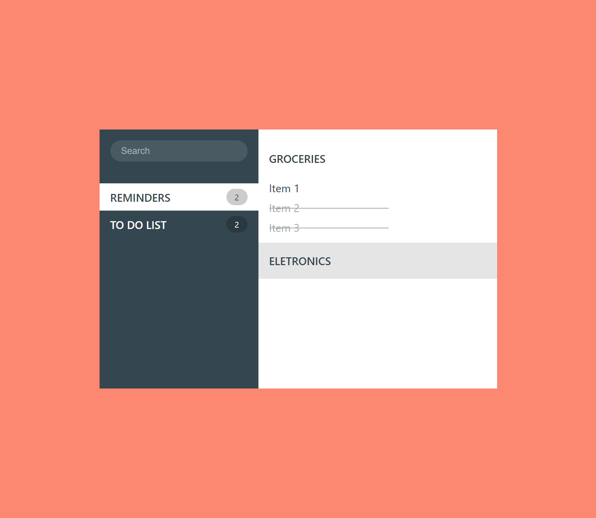

# ICodeThis - Reminder App

This is a solution to the "Reminder App" challenge on [ICodeThis](https://icodethis.com).

## Table of contents

- [Overview](#overview)
  - [The challenge](#the-challenge)
  - [Screenshot](#screenshot)
  - [Links](#links)
- [The process](#the-process)
  - [Built with](#built-with)
  - [Continued development](#continued-development)
  - [Useful resources](#useful-resources)
- [Author](#author)

## Overview

### The challenge

The challenge was create by [ICodeThis](https://icodethis.com).

Challenge:

- Replicate the image in HTML and CSS.

### Screenshot

_Screenshot of the final product_

### Links

- Repository: [Github](https://github.com/pedrocosta132/react-challenges/)
- Live version: not available

## The process

### Built with

- HTML & CSS
- [React](https://reactjs.org/) + [Vite](https://vitejs.dev)
- [Styled Components](https://styled-components.com/)

### Continued development

This is a component meant to beat the challenge, it is not ready for production.

Create the functionality to add and modify data.

## Author

- Github - [@pedrocosta132](https://github.com/pedrocosta132)
