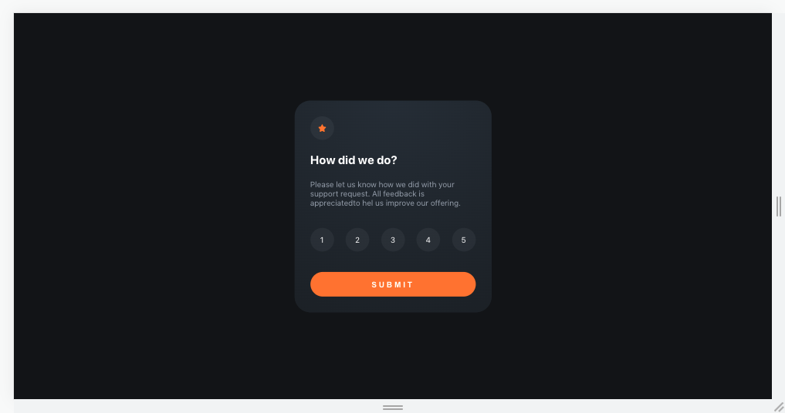
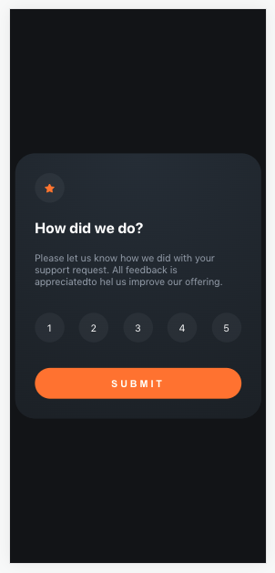

# Interactive Rating Component

This is a solution to the Interactive rating component challenge on [Frontend Mentor](https://www.frontendmentor.io/challenges/interactive-rating-component-koxpeBUmI).

## Table of contents

- [Overview](#overview)
  - [The challenge](#the-challenge)
  - [Screenshot](#screenshot)
  - [Links](#links)
- [The process](#the-process)
  - [Built with](#built-with)
  - [Continued development](#continued-development)
  - [Useful resources](#useful-resources)
- [Author](#author)

## Overview

### The challenge

The challenge was create by [Frontend Mentor](https://www.frontendmentor.io/challenges/interactive-rating-component-koxpeBUmI).
A descriptive guide was provided as well as a screenshot of product design.

Desired functionalities:

- View the optimal layout for the app depending on their device's screen size
- See hover states for all interactive elements on the page
- Select and submit a number rating
- See the "Thank you" card state after submitting a rating

### Screenshot

*Screenshot Desktop*

*Screenshot Mobile*

### Links

- Repository: Not available yet
- Live version: Not available yet

## The process

### Built with

- HTML & CSS
- [React](https://reactjs.org/) + [Vite](https://vitejs.dev)
- [Styled Components](https://styled-components.com/)

### Continued development

This is a component meant to beat the challenge, is not ready for production.

For future development, it would be nice to optimize the CSS and focus a little more on accessibility.

### Useful resources

- [Style Guide]('./style-guide.md') - This is the style guide used to create the project.

## Author

- Personal Website - [Pedro Costa](https://pedrocosta132.github.io/)
- Github - [@pedrocosta132](https://github.com/pedrocosta132)
- Frontend Mentor Profile - [@pedrocosta132](https://www.frontendmentor.io/profile/pedrocosta132)
