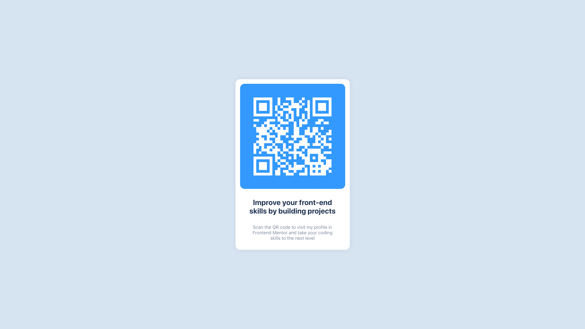
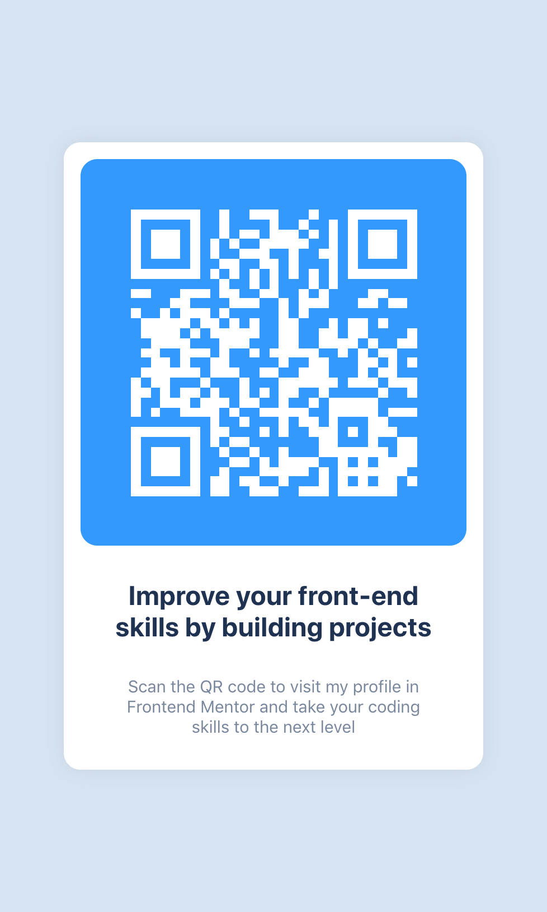

# CHALLENGE_NAME

This is a solution to the CHALLENGE_NAME challenge on [WEBSITE](https://).

## Table of contents

- [Overview](#overview)
  - [The challenge](#the-challenge)
  - [Screenshot](#screenshot)
  - [Links](#links)
- [The process](#the-process)
  - [Built with](#built-with)
  - [Continued development](#continued-development)
  - [Useful resources](#useful-resources)
- [Author](#author)

## Overview

### The challenge

The challenge was create by [WEBSITE](https://).
Description of the challenge.

Challenge:

- Requirements of the challenge

### Screenshot

*Screenshot of the final product on Desktop*

*Screenshot of the final product on Mobile*

### Links

- Repository: [Github](https://github.com/pedrocosta132/react-challenges/)
- Live version: [Netlify](https://netlify.app/)

## The process

### Built with

- HTML & CSS
- [React](https://reactjs.org/) + [Vite](https://vitejs.dev)
- [Styled Components](https://styled-components.com/)

### Continued development

This is a component meant to beat the challenge, it is not ready for production.

For future development, it would be nice to focus more on accessibility.

### Useful resources

- [Style Guide](./style-guide.md) - This is the style guide used to create the project.

## Author

- Personal Website - [Pedro Costa](https://pedrocosta132.github.io/)
- Github - [@pedrocosta132](https://github.com/pedrocosta132)
- WEBSITE Profile - [@pedrocosta132](https://)
